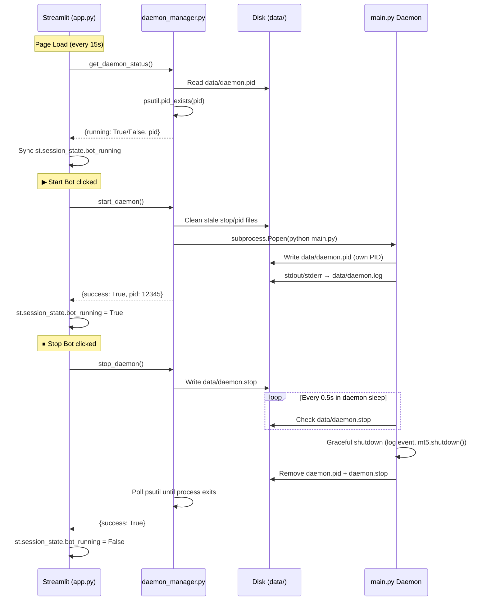

# 🔧 Implementation Plan: Functional Start/Stop Bot Buttons

> **Status**: Pending Implementation  
> **Created**: 2026-05-21  
> **Scope**: Wire the dashboard's ▶ Start / ⏹ Stop buttons to actually manage the `main.py` background daemon as a subprocess.

---

## 📋 Problem Statement

Currently, the **Start Bot** and **Stop Bot** buttons in `app.py` are purely cosmetic:

```python
# Current behavior — just flips a UI flag, does NOTHING to main.py
if st.button("▶  Start Bot"):
    st.session_state.bot_running = True       # ← session-only flag
    st.session_state.start_time = datetime.now()
    _add_event("info", "Bot STARTED ...")
    st.rerun()
```

**What `bot_running = True` affects today (all visual-only):**

| Location | Effect | Type |
|---|---|---|
| `app.py:210` | Pipeline nodes glow purple | 🎨 Visual |
| `app.py:228` | Disables Start button | 🎨 Visual |
| `app.py:235` | Enables Stop button | 🎨 Visual |
| `app.py:279-286` | Shows 🟢/🔴 status badge | 🎨 Visual |
| `app.py:67` | Uptime counter starts ticking | 🎨 Visual |

**What it does NOT do:**
- ❌ Does not start `main.py` (the actual trading daemon)
- ❌ Does not connect to MT5
- ❌ Does not trigger any trading pipeline
- ❌ Is not read by `main.py`, any page, or any `core/` module
- ❌ Does not persist — lost on page refresh

The actual trading is done by `main.py` running independently in a terminal.

---

## 🏗️ Architecture



### Why stop-file instead of OS signals?

| Mechanism | Windows Support | Graceful? | Reliable? |
|---|---|---|---|
| `SIGTERM` | ❌ Cannot be caught — just kills process | ❌ No | ❌ No |
| `SIGINT` | ⚠️ Only within same console session | ✅ Yes | ⚠️ Fragile |
| `CTRL_BREAK_EVENT` | ⚠️ Requires `CREATE_NEW_PROCESS_GROUP` | ✅ Yes | ⚠️ Complex |
| **Stop file** | ✅ Works everywhere | ✅ Yes | ✅ Yes |

The stop-file approach is the most reliable on Windows. The daemon checks for `data/daemon.stop` every 0.5 seconds during its existing 10-second sleep, so max shutdown latency is 0.5 seconds.

---

## 📁 Files to Change

| File | Action | Description |
|---|---|---|
| `core/daemon_manager.py` | **NEW** | Process management module (start/stop/status) |
| `main.py` | **MODIFY** | PID file + stop-file polling + cleanup on exit |
| `app.py` | **MODIFY** | Wire buttons + sync state from real process |

### Dependencies

- `psutil==7.1.3` — already in `requirements.txt` (line 122)
- No new dependencies needed

---

## 📦 File 1: `core/daemon_manager.py` (NEW)

### Purpose
Clean module to manage the `main.py` daemon lifecycle. Used by `app.py` only.

### API

```python
def get_daemon_status() -> dict:
    """
    Check if the daemon is running.
    
    Returns:
        {
            "running": bool,       # True if process is alive
            "pid": int | None,     # Process ID or None
        }
    
    Logic:
        1. Read data/daemon.pid
        2. If file missing → not running
        3. If file exists → check psutil.pid_exists(pid)
        4. If process dead → remove stale PID file → not running
        5. Extra safety: verify process name contains 'python' (avoid PID reuse)
    """

def start_daemon() -> dict:
    """
    Start main.py as a detached background process.
    
    Returns:
        {
            "success": bool,
            "pid": int | None,
            "error": str | None,
        }
    
    Logic:
        1. Check if already running → return error
        2. Clean stale daemon.stop and daemon.pid files
        3. Ensure data/ directory exists
        4. Open data/daemon.log for append (stdout/stderr target)
        5. subprocess.Popen(
               [sys.executable, "main.py"],
               cwd=PROJECT_ROOT,
               stdout=log_file, stderr=STDOUT,
               creationflags=CREATE_NO_WINDOW | CREATE_NEW_PROCESS_GROUP
           )
        6. Wait briefly for main.py to write its own PID file
        7. Return success + PID
    """

def stop_daemon(timeout: int = 15) -> dict:
    """
    Stop the daemon gracefully via stop file.
    
    Returns:
        {
            "success": bool,
            "error": str | None,   # "Force-killed" if timeout exceeded
        }
    
    Logic:
        1. Check if running → if not, return success (already stopped)
        2. Create data/daemon.stop file (contents: PID)
        3. Poll every 0.5s for up to `timeout` seconds:
           - If process exits → clean up files → return success
        4. If timeout → force kill via psutil → return with warning
    """
```

### Key Implementation Details

```python
import subprocess
import sys
import psutil
from pathlib import Path

PROJECT_ROOT = Path(__file__).parent.parent
PID_FILE = PROJECT_ROOT / "data" / "daemon.pid"
STOP_FILE = PROJECT_ROOT / "data" / "daemon.stop"
LOG_FILE = PROJECT_ROOT / "data" / "daemon.log"
MAIN_PY = PROJECT_ROOT / "main.py"
```

**Process verification** — not just PID existence, but also name check:
```python
def _is_daemon_alive(pid: int) -> bool:
    """Check PID is alive AND is a Python process (guards against PID reuse)."""
    try:
        proc = psutil.Process(pid)
        return proc.is_running() and "python" in proc.name().lower()
    except (psutil.NoSuchProcess, psutil.AccessDenied):
        return False
```

**Detached subprocess on Windows:**
```python
creationflags = subprocess.CREATE_NO_WINDOW | subprocess.CREATE_NEW_PROCESS_GROUP
```

---

## 📦 File 2: `main.py` (MODIFY)

### Change 1: Write PID file on startup

Add after `engine = TradingEngine(mode="live")`:

```python
PID_FILE = Path("data/daemon.pid")
STOP_FILE = Path("data/daemon.stop")

def _write_pid():
    """Write our PID to disk so the dashboard can track us."""
    PID_FILE.parent.mkdir(parents=True, exist_ok=True)
    PID_FILE.write_text(str(os.getpid()))
    # Clean any stale stop request from a previous session
    STOP_FILE.unlink(missing_ok=True)
```

Call `_write_pid()` at the top of `main_loop()`.

### Change 2: Replace `time.sleep(10)` with stop-file polling

Current code:
```python
time.sleep(10)  # ← blind sleep, no way to interrupt
```

New code:
```python
# Interruptible sleep: check for stop signal every 0.5s
for _ in range(20):  # 20 × 0.5s = 10s total
    if STOP_FILE.exists():
        _graceful_shutdown("stop_file")
    time.sleep(0.5)
```

### Change 3: Unified shutdown function

Merge the signal handler and stop-file exit into one function:

```python
def _graceful_shutdown(source: str):
    """
    Unified shutdown — called by SIGINT handler OR stop-file detection.
    
    Args:
        source: "SIGINT", "SIGTERM", or "stop_file"
    """
    print(f"\n⚡ Shutting down Trade Pulse Quants daemon (via {source})...")

    # 1. Log shutdown event
    try:
        engine.storage.log_event("info", f"Background Engine stopped (graceful shutdown via {source}).")
    except Exception:
        pass

    # 2. Close MT5 connection
    try:
        import MetaTrader5 as mt5
        mt5.shutdown()
    except Exception:
        pass

    # 3. Clean up PID and stop files
    PID_FILE.unlink(missing_ok=True)
    STOP_FILE.unlink(missing_ok=True)

    sys.exit(0)
```

Update signal handler to use it:
```python
def _shutdown_handler(signum, frame):
    _graceful_shutdown(signal.Signals(signum).name)
```

---

## 📦 File 3: `app.py` (MODIFY)

### Change 1: Import daemon manager

```python
from core.daemon_manager import get_daemon_status, start_daemon, stop_daemon
```

### Change 2: Sync state on every page load

Add before the bot controls section:

```python
# ── Sync bot state with actual daemon process ──
_daemon_status = get_daemon_status()
st.session_state.bot_running = _daemon_status["running"]
st.session_state._daemon_pid = _daemon_status["pid"]
if not _daemon_status["running"]:
    st.session_state.start_time = None
```

### Change 3: Wire Start button

```python
with col_start:
    if st.button("▶  Start Bot", use_container_width=True, disabled=st.session_state.bot_running):
        result = start_daemon()
        if result["success"]:
            st.session_state.bot_running = True
            st.session_state.start_time = datetime.now()
            st.session_state._daemon_pid = result["pid"]
            _add_event("info", f"Bot STARTED · PID={result['pid']} · mode={st.session_state.bot_mode}")
            st.toast(f"✅ Daemon started (PID {result['pid']})", icon="🚀")
        else:
            st.error(f"Failed to start bot: {result['error']}")
        st.rerun()
```

### Change 4: Wire Stop button

```python
with col_stop:
    if st.button("⏹  Stop Bot", use_container_width=True, disabled=not st.session_state.bot_running):
        with st.spinner("Stopping daemon gracefully..."):
            result = stop_daemon(timeout=15)
        if result["success"]:
            st.session_state.bot_running = False
            st.session_state.start_time = None
            _add_event("info", "Bot STOPPED · graceful shutdown complete")
            if result.get("error"):
                st.warning(result["error"])  # e.g. "Force-killed after timeout"
            else:
                st.toast("✅ Daemon stopped gracefully", icon="⏹️")
        else:
            st.error(f"Failed to stop bot: {result['error']}")
        st.rerun()
```

---

## 🔄 Edge Cases Handled

| Scenario | Behavior |
|---|---|
| **Double-start** | `start_daemon()` checks PID file → returns `{success: False, error: "already running"}` |
| **Daemon crashes** | Page load calls `get_daemon_status()` → detects PID is dead → cleans stale file → shows 🔴 |
| **PID reuse by OS** | `_is_daemon_alive()` checks process name contains "python" → rejects non-Python processes |
| **Stale stop file** | `main.py` cleans `daemon.stop` on startup; `start_daemon()` also cleans it |
| **Manual `python main.py`** | Works fine — main.py writes its own PID file, dashboard detects it on next load |
| **Streamlit restarts** | PID file persists on disk, so status check works across Streamlit sessions |
| **Stop timeout** | After 15 seconds, `stop_daemon()` force-kills via `psutil` and returns warning |

---

## 📊 File Locations

```
data/
├── daemon.pid          # Contains PID of running main.py (e.g., "12345")
├── daemon.stop         # Created by Stop button, detected by main.py
├── daemon.log          # stdout/stderr from subprocess (append mode)
├── events.jsonl        # Existing — shutdown events logged here
├── bot_state.json      # LEGACY — not used (from previous attempt)
└── bot_lifecycle.log   # LEGACY — not used (from previous attempt)
```

---

## ✅ Verification Checklist

1. **Start**: Click ▶ → `data/daemon.pid` appears → process visible in Task Manager → dashboard shows 🟢 with PID
2. **Status sync**: Refresh page → green status persists (reads from PID file, not session)
3. **Stop**: Click ⏹ → process exits within 0.5s → `daemon.pid` removed → dashboard shows 🔴
4. **Crash recovery**: Kill daemon in Task Manager → refresh dashboard → correctly shows 🔴 (stale PID detected)
5. **Double-start**: Click ▶ when running → error toast "Daemon is already running"
6. **Manual start**: Run `python main.py` in terminal → refresh dashboard → correctly shows 🟢 with PID
7. **Graceful shutdown**: Check `data/events.jsonl` for shutdown log entry after stop
8. **MT5 cleanup**: Verify MT5 terminal shows disconnected after stop
