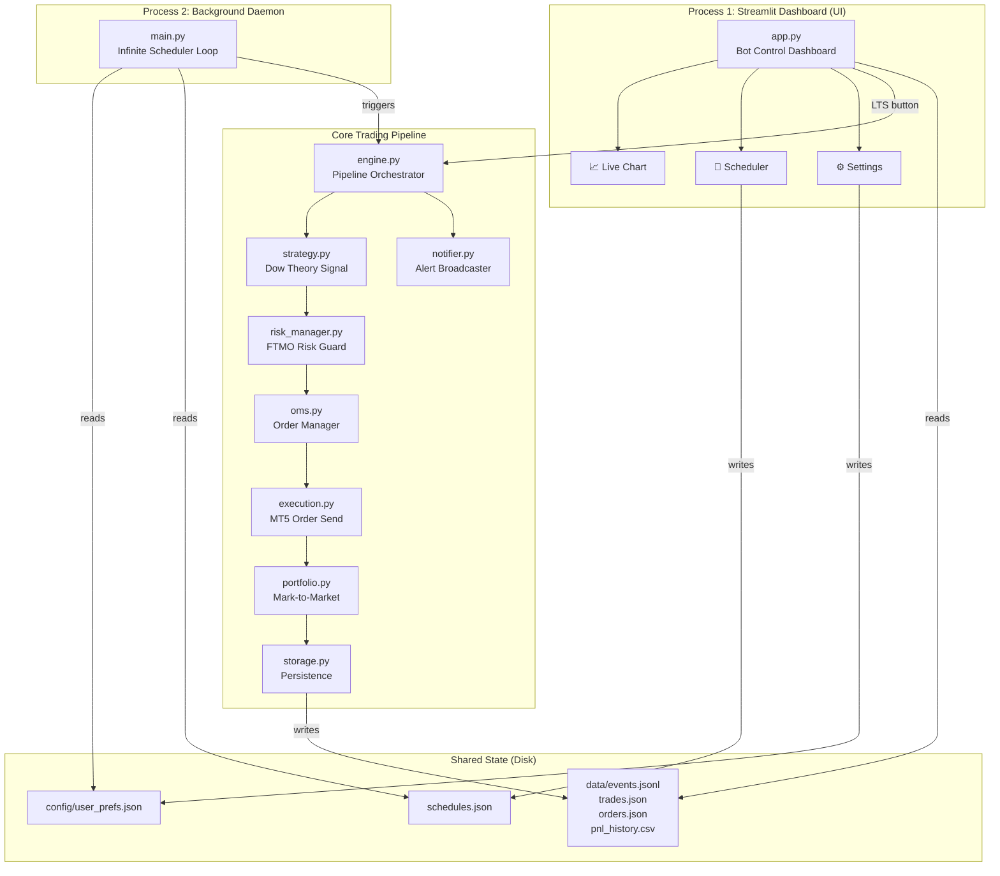

# ⚡ Trade Pulse Quants — Complete Codebase Analysis

> **Event-Driven Live Trading Engine for FTMO Prop Firm Accounts**
> MetaTrader 5 · Dow Theory EMA Cross Strategy · FTMO Risk Guard · Multi-Channel Alerts

---

## 🏗️ Architecture Overview

The system is a **two-process architecture** designed for FTMO Challenge/Funded accounts:



| Layer | Entry Point | Role |
|---|---|---|
| **Streamlit Dashboard** | `streamlit run app.py` | Configure, monitor, manually trigger |
| **Background Daemon** | `python main.py` | 24/7 scheduler, fires pipeline on schedule |

Communication between layers is via **shared JSON files** on disk — no sockets, no queues, no database.

---

## 📁 Project Structure (30 source files)

| Directory | Files | Purpose |
|---|---|---|
| **Root** | `app.py`, `main.py` | UI entry + daemon entry |
| **`core/`** (16 files) | Engine, strategy, risk, OMS, execution, portfolio, storage, notifier, chart, MT5 helpers | All trading logic |
| **`pages/`** (3 files) | Live Chart, Scheduler, Settings | Streamlit multi-page app |
| **`Utilities/`** (2 files) | UI components, technical indicators | Shared CSS + EMA/RSI/ATR |
| **`config/`** (2+1 files) | `config.py`, `user_prefs.json` | Singleton config + runtime prefs |
| **`data/`** | Events, trades, orders, PnL CSV | Runtime data persistence |
| **Root scripts** | `_patch2.py`, `_write_final.py` | Historical one-time patch scripts (not part of runtime) |

---

## 🔄 Event Pipeline (The Core Flow)

When the daemon or the manual LTS button triggers `engine.run_pipeline_tick()`:

```
1. DATA FEED     → fetch_mt5_candles() + fetch_mt5_ltp()
2. STRATEGY      → RealTimeSignalGenerator.run_analysis() → BUY/SELL/HOLD
3. SIGNAL STORE  → save_signal() to data/signals.json (audit trail)
4. RISK GUARD    → evaluate_ftmo_rules() — 6 checks
5. ORDER BUILD   → build_order() — ADR-based SL/TP + leverage-validated lots
6. OMS           → submit() — duplicate prevention
7. EXECUTION     → mt5.order_send() — live market order
8. PORTFOLIO     → on_fill() + mark_to_market()
9. STORAGE       → save_trade(), save_order(), save_pnl_snapshot()
10. NOTIFIER     → Telegram + Email + Desktop Toast + Sound
```

---

## 📦 Module-by-Module Breakdown

### [`main.py`](file:///c:/Users/admin/Desktop/PropFirm%20Project/Prop_Firm/main.py) — Background Daemon

- Runs an infinite `while True` loop with **10-second sleep**.
- Checks the clock **once per minute** (dedup via `last_run_minute`).
- Uses **dual timezone tracking**:
  - `Europe/Helsinki` (GMT+3) for **schedule matching** (aligns with MT5 chart time)
  - `Europe/Prague` (CET/CEST) for **daily SOD balance reset** (FTMO dashboard time)
- At `daily_reset_time` (Prague time), reconnects MT5 and snapshots `ftmo_sod_balance`.
- On schedule match, calls `engine.run_pipeline_tick()` and spawns `process_and_broadcast()` in a background thread.
- Crash resilience: any pipeline failure sends a `broadcast_risk_alert()` via Telegram.

---

### [`app.py`](file:///c:/Users/admin/Desktop/PropFirm%20Project/Prop_Firm/app.py) — Streamlit Dashboard (Page 1)

- **Auto-refreshes every 3 seconds** (`time.sleep(3); st.rerun()`) — always pulls live MT5 equity.
- Connects to MT5 directly via `_load_live_state()` to read equity/profit/positions.
- Displays: Event Pipeline diagram, Bot Controls, Live Metrics (trades, positions, PnL, equity), Event Log, Active Config summary.
- **LTS button** ("Last Trading Signal"): creates a temporary `TradingEngine`, runs `run_pipeline_tick(is_manual=True)`, and spins off `process_and_broadcast()` in a thread.
- Reads `data/events.jsonl` written by the daemon to show live event stream.

---

### [`core/engine.py`](file:///c:/Users/admin/Desktop/PropFirm%20Project/Prop_Firm/core/engine.py) — Pipeline Orchestrator

- Central `TradingEngine` class that wires all components together.
- `run_pipeline_tick()` (437 lines) is the heart — executes the full 10-step pipeline.
- Reads `config/user_prefs.json` **fresh on every tick** (no stale state).
- Syncs `starting_balance` from `ftmo_sod_balance` pref for drawdown calculations.
- Fetches MT5 symbol info (`tick_size`, `tick_value`, `contract_size`) and account info (`leverage`, `free_margin`) live.
- Computes **ADR** (14-day Average Daily Range) by resampling OHLCV to daily candles.
- Every failure point broadcasts a Telegram alert — data fetch fail, symbol info unavailable, account info unavailable, ADR computation fail, order build fail, execution fail.

---

### [`core/strategy.py`](file:///c:/Users/admin/Desktop/PropFirm%20Project/Prop_Firm/core/strategy.py) — Signal Generator

Two classes:
1. **`Strategy`** (base class): Abstract, not used in production — defines `on_market_event()` interface.
2. **`RealTimeSignalGenerator`**: The actual implementation.

**Dow Theory EMA Cross Strategy:**
- Calculates Fast EMA + Slow EMA (configurable, default 3/8)
- Determines **market phase**: `BULLISH` (Close > Fast > Slow), `BEARISH` (Close < Fast < Slow), `SIDEWAYS`
- Uses **5-candle fractal logic** to detect swing highs/lows
- **BUY signal**: Phase is BULLISH + Close breaks above last fractal high
- **SELL signal**: Phase is BEARISH + Close breaks below last fractal low
- **Filters** (optional):
  - Volume filter: candle volume must exceed 21-period MA
  - ATR slope filter: ATR must be rising (expanding volatility = breakout confirmation)
- **Deduplication**: Won't repeat same signal unless the breakout level changes (prevents pyramiding on same level)
- Returns full DataFrame with indicators + historical signals for chart visualization

---

### [`core/risk_manager.py`](file:///c:/Users/admin/Desktop/PropFirm%20Project/Prop_Firm/core/risk_manager.py) — FTMO Risk Guard

**Part 1: `evaluate_ftmo_rules()` — 6 Pre-Trade Checks:**

| Check | Rule | Action |
|---|---|---|
| 1 | Daily loss ≥ 5% of starting balance | **BLOCK** |
| 2 | Total drawdown ≥ 10% of starting balance | **BLOCK** |
| 3 | Daily budget remaining < risk per trade ($100) | **BLOCK** |
| 4 | Max DD buffer < risk per trade | **BLOCK** |
| 5 | Open positions ≥ max (default 1) — uses live `mt5.positions_total()` | **BLOCK** |
| 6 | News blackout ±2 min of HIGH-impact ForexFactory event (leverage > 1:30 only) | **BLOCK** |

- Progressive warnings at 50% and 80% thresholds for checks 1 & 2.
- News calendar fetched from ForexFactory API, cached per FTMO calendar day.
- All times handled in UTC internally; displayed in both FTMO time (Helsinki) and IST.

**Part 2: `build_order()` — ADR-Based Position Sizing:**
- SL = 15% of 14-day Average Daily Range
- TP = SL × R:R ratio (default 1:2)
- Lot size = `risk_per_trade / (sl_ticks × tick_value)`
- Leverage constraint: scales lots down if margin needed > 30% of free margin
- Minimum lot floor: 0.01

---

### [`core/execution.py`](file:///c:/Users/admin/Desktop/PropFirm%20Project/Prop_Firm/core/execution.py) — MT5 Order Execution

- Routes directly to `_execute_mt5()` — no backtest/paper mode implemented (only stubs in docstrings).
- Builds MT5 request with `TRADE_ACTION_DEAL`, IOC filling, GTC time, 20-point deviation.
- Uses ask price for BUY, bid price for SELL.
- Magic number: `234000`, comment: `"Trade Pulse"`.
- Returns `FillEvent` with fill price, slippage, MT5 order/deal IDs.

---

### [`core/oms.py`](file:///c:/Users/admin/Desktop/PropFirm%20Project/Prop_Firm/core/oms.py) — Order Management System

- In-memory order book (lost on restart — persistence handled by Storage).
- **Duplicate prevention**: blocks new orders for same symbol + same side if one is already PENDING/SUBMITTED.
- Lifecycle: `PENDING → SUBMITTED → FILLED | REJECTED | CANCELLED`.
- 8-character UUID order IDs.
- Supports modify (qty, SL, TP) and cancel operations.

---

### [`core/portfolio.py`](file:///c:/Users/admin/Desktop/PropFirm%20Project/Prop_Firm/core/portfolio.py) — Portfolio Tracker

- Tracks positions, cash, and PnL in-memory.
- Handles position adding, reducing, and reversing on fills.
- `mark_to_market()` updates unrealized PnL with current prices.
- In practice, the engine falls back to **live MT5 account values** for reporting — the Portfolio is mainly a secondary/fallback tracker.

---

### [`core/notifier.py`](file:///c:/Users/admin/Desktop/PropFirm%20Project/Prop_Firm/core/notifier.py) — Multi-Channel Alert Broadcaster

Four channels (all run in background threads):
1. **Windows Desktop Toast** — via PowerShell `NotifyIcon`
2. **Sound** — `winsound.MessageBeep` + `Beep(1000, 500)`
3. **Telegram** — Bot API with chart image + MarkdownV2 formatted message
4. **Email** — Gmail SMTP SSL with chart attachment

Two broadcast modes:
- `broadcast_lts_signal()` — for trade signals (includes chart PNG)
- `broadcast_risk_alert()` — for FTMO blocks/warnings (no chart)

`process_and_broadcast()` — high-level function that:
1. Builds JSON payload from engine result
2. Generates Plotly chart snapshot via `chart_utils.generate_trade_chart()`
3. Converts chart to PNG bytes via `fig.to_image()`
4. Dispatches to all channels

---

### [`core/storage.py`](file:///c:/Users/admin/Desktop/PropFirm%20Project/Prop_Firm/core/storage.py) — Persistence Layer

| File | Format | Contents |
|---|---|---|
| `data/events.jsonl` | JSON Lines | Live event log (shared between daemon and UI) |
| `data/trades.json` | JSON | Fill records |
| `data/orders.json` | JSON | Order lifecycle records |
| `data/pnl_history.csv` | CSV | Equity snapshots (timestamp, equity, cash, PnL, positions) |

---

### [`core/chart_utils.py`](file:///c:/Users/admin/Desktop/PropFirm%20Project/Prop_Firm/core/chart_utils.py) — Chart Renderer

- Plotly 2-row chart: candlestick + volume
- EMA overlays (fast=purple, slow=white)
- Fractal High/Low horizontal lines
- BUY/SELL signal markers (triangles)
- Category x-axis (no weekend gaps)
- Dark mode variant for Telegram/Email snapshots

---

### [`core/scheduler_helper.py`](file:///c:/Users/admin/Desktop/PropFirm%20Project/Prop_Firm/core/scheduler_helper.py) — Auto-Schedule Generator

- Generates FTMO-compliant trading slots for Mon–Fri, 01:05–23:59 Helsinki time.
- Aligned to timeframe intervals (e.g., 1h → hourly slots from 02:00–23:00).
- Purges all existing schedules on generation.
- Sends Telegram notification on schedule update.

---

### [`Utilities/technical_indicators.py`](file:///c:/Users/admin/Desktop/PropFirm%20Project/Prop_Firm/Utilities/technical_indicators.py) — Indicator Library

- `calculate_ema()` — Exponential Moving Average (pandas `ewm`)
- `calculate_rsi()` — Relative Strength Index (Wilder's smoothing)
- `calculate_atr()` — Average True Range (Wilder's smoothing)

---

### [`Utilities/ui_components.py`](file:///c:/Users/admin/Desktop/PropFirm%20Project/Prop_Firm/Utilities/ui_components.py) — Shared UI

- `load_css()` — 360+ lines of custom CSS (Inter font, dark theme, glassmorphism cards, pipeline diagram, event log styling)
- `init_session_state()` — bootstraps all Streamlit session state from `user_prefs.json`
- `render_sidebar()` — common sidebar across all pages (execution mode, strategy params, notification toggles)

---

## ⏱️ Timezone Architecture

The system handles **three timezones** carefully:

| Timezone | Usage |
|---|---|
| `Europe/Helsinki` (GMT+3 summer) | MT5 chart time, schedule matching, FTMO server time |
| `Europe/Prague` (CET/CEST) | FTMO daily reset, drawdown tracking, account dashboard |
| `Asia/Kolkata` (IST) | Display for user convenience in alerts |

---

## 🔍 Notable Observations & Potential Issues

### 1. Bug in `app.py` LTS Handler (Lines 266–271)
```python
# Duplicate warning loop:
for w in result.get('risk_warnings', []):
    st.warning(w)
for w in result.get('risk_warnings', []):  # ← exact duplicate
    st.warning(w)

# References undefined variables:
st.toast(f"LTS Success: {sig} @ {ltp} ({src})", icon="🚀")
# ↑ sig, ltp, src are NOT defined in this scope
```

### 2. Dead / Legacy Code
- [`config/config.py`](file:///c:/Users/admin/Desktop/PropFirm%20Project/Prop_Firm/config/config.py) — `_Config` singleton references Dhan API credentials. Not used anywhere in active pipeline (everything reads from `user_prefs.json` directly).
- [`core/prop_firm_risk.py`](file:///c:/Users/admin/Desktop/PropFirm%20Project/Prop_Firm/core/prop_firm_risk.py) — Simplified `PropFirmRiskManager` class — superseded by `risk_manager.py`'s full FTMO guard. Not imported anywhere.
- [`core/data_feed.py`](file:///c:/Users/admin/Desktop/PropFirm%20Project/Prop_Firm/core/data_feed.py) — Abstract `DataFeed` class with `NotImplementedError` stubs. Only `MarketEvent` dataclass is imported (by `strategy.py`).
- [`_patch2.py`](file:///c:/Users/admin/Desktop/PropFirm%20Project/Prop_Firm/_patch2.py) and [`_write_final.py`](file:///c:/Users/admin/Desktop/PropFirm%20Project/Prop_Firm/_write_final.py) — One-time patch scripts used to build `risk_manager.py`. Should be cleaned up.
- `review.txt` — Developer notes/documentation, references a non-existent `4_📝_Paper_Trading.py` page.

### 3. Auto-Refresh Concern
- `app.py` calls `time.sleep(3); st.rerun()` unconditionally — this means the dashboard page **reloads every 3 seconds forever**, consuming MT5 API calls continuously.

### 4. Strategy Base Class Not Used
- The `Strategy` base class in `strategy.py` defines an `on_market_event()` interface, but `RealTimeSignalGenerator` doesn't inherit from it. The two classes are in the same file but disconnected.

### 5. Schedules Include Weekends
- The current `schedules.json` has Saturday and Sunday slots. FTMO markets are closed on weekends, so these slots will fire but return empty data / fail silently.

### 6. No Graceful Shutdown
- `main.py` catches `Ctrl+C` via default Python behavior but doesn't call `mt5.shutdown()` or any cleanup.

---

## 📊 Data Flow Summary

```
User (Settings Page)
    ↓ saves to
config/user_prefs.json ←→ main.py (reads every minute)
                        ←→ engine.py (reads every tick)
                        ←→ app.py (reads on load)

User (Scheduler Page)
    ↓ saves to
schedules.json ←→ main.py (reads every minute)

main.py / app.py (LTS button)
    ↓ triggers
engine.run_pipeline_tick()
    ↓ writes to
data/events.jsonl    ← app.py reads & displays
data/trades.json     ← historical record
data/orders.json     ← order lifecycle
data/pnl_history.csv ← equity timeseries
```

---

## 🧮 Key Configuration (from `user_prefs.json`)

| Setting | Default | Purpose |
|---|---|---|
| `trading_symbol` | `XAUUSD` | MT5 instrument |
| `timeframe` | `1h` | Candle resolution |
| `ema_fast` / `ema_slow` | `5` / `8` | EMA periods for Dow Theory |
| `use_atr_filter` | `true` | Require rising ATR for signals |
| `use_vol_filter` | `false` | Require above-average volume |
| `bar_count` | `350` | Historical candles to fetch |
| `initial_balance` | `10000` | Account starting balance |
| `daily_reset_time` | `00:00` | SOD snapshot time (Prague TZ) |
| `execution_mode` | `MetaTrader5` | Always MT5 (hardcoded in engine) |

---

## Summary

This is a **production-grade algorithmic trading system** specifically tailored for FTMO prop firm accounts. The architecture is clean and well-separated: the UI configures rules, the daemon executes them, and they communicate via shared JSON files. The risk management is thorough (6 pre-trade checks including news blackout), the strategy is a classic Dow Theory fractal breakout with momentum filters, and the notification system covers all bases (Telegram, Email, Desktop, Sound). The codebase is about **~5,000 lines of Python** across 30 files, with a few areas of dead code and minor bugs that could be cleaned up.
